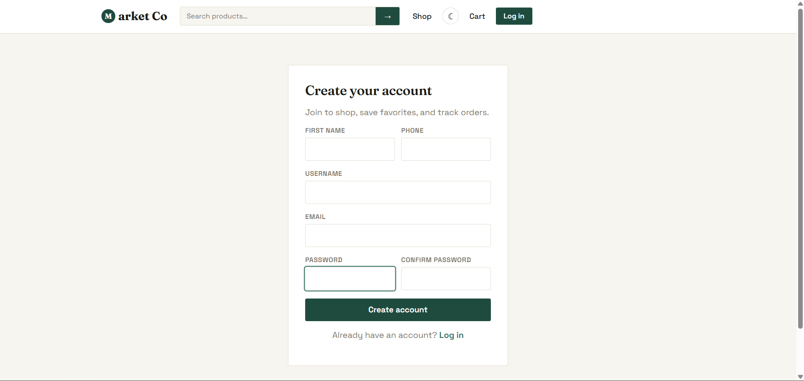
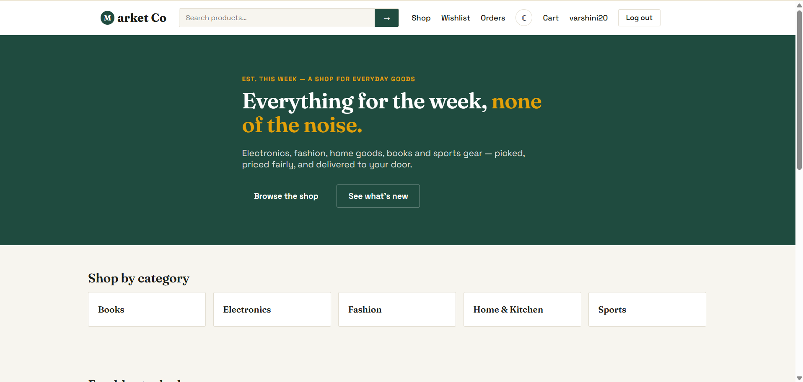
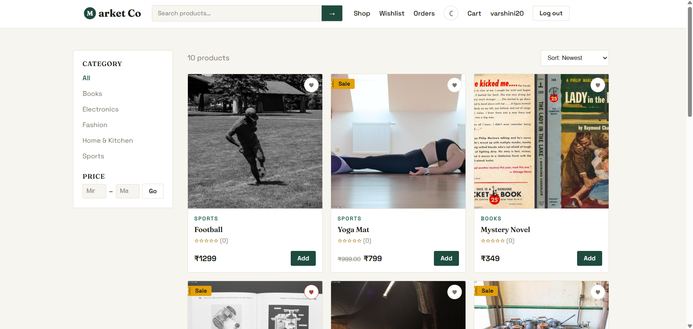
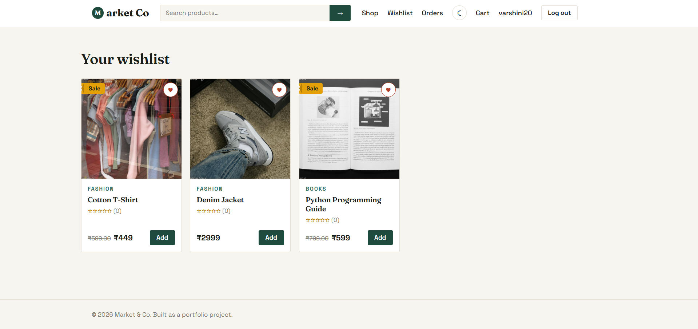
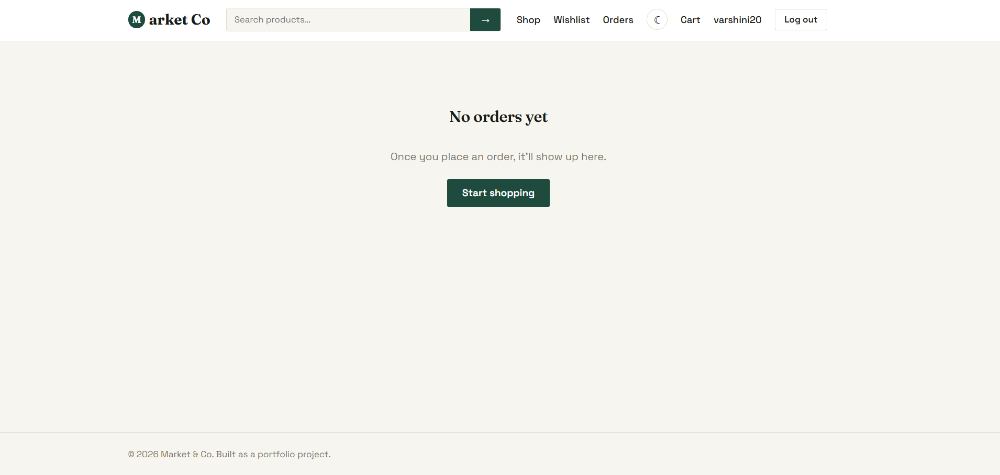
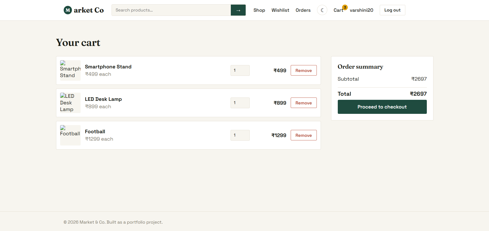
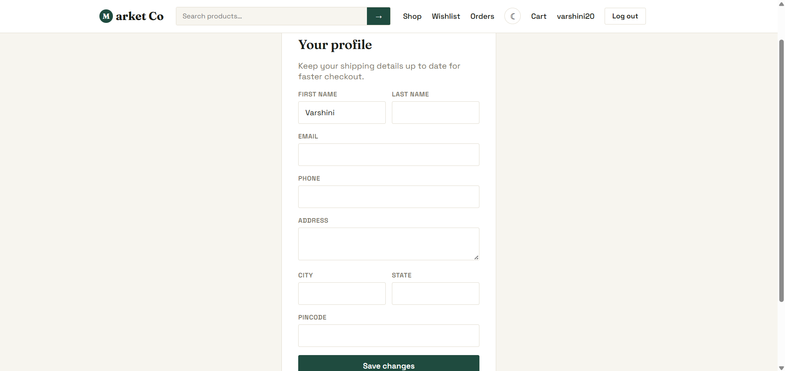

# 🛒 Market & Co — Full-Stack E-Commerce Website

A modern full-stack e-commerce platform built with Django REST Framework and React (Vite), featuring secure JWT authentication, shopping cart, wishlist, checkout, admin dashboard, and responsive design.

---

## Features

**Customer side:** home page, product listing with search/filter/sort, product detail with
reviews & ratings, categories, cart, wishlist, JWT-based registration/login, checkout with
coupon codes, order history, editable profile, dark mode.

**Admin side:** product CRUD, category CRUD, order status management, coupon management,
sales dashboard (revenue, order counts, low stock, top products) — usable via the built-in
Django admin at `/admin/` or the custom React admin panel at `/admin` in the app.

**Extras included:** JWT auth with auto-refresh, email order confirmation (console backend by
default), Razorpay payment integration (stubbed until you add real API keys), stock deduction
on order, responsive layout.

---

## Project structure

```
ecommerce-project/
├── backend/            Django + DRF API
│   ├── ecommerce/      settings, root urls
│   ├── users/          custom user model, JWT auth
│   ├── products/       categories, products, reviews, wishlist
│   ├── cart/           cart & cart items
│   ├── orders/         checkout, order history, coupons
│   └── payments/       Razorpay integration, sales dashboard
└── frontend/           React (Vite) app
    └── src/
        ├── api/         axios client with JWT refresh
        ├── context/      Auth, Cart, Theme providers
        ├── components/   Navbar, ProductCard, route guards
        └── pages/        all app pages, admin panel under pages/admin
```
---
## Live Demo

https://e-commerce-website-flame-zeta.vercel.app

---

### Screenshots

### Signup/Login page


### Home page 


### Shop page 


### Wishlist page 


### Order page 


### Cart page 


### Profile page 


---

## Running it locally in VS Code

### 1. Backend (Django)

```bash
cd backend
python -m venv venv
# Windows: venv\Scripts\activate
source venv/bin/activate
pip install -r requirements.txt

python manage.py migrate
python manage.py seed_data      # creates sample categories/products + admin login
python manage.py runserver      # http://127.0.0.1:8000
```

Seed data creates a superuser: **admin / admin12345** (also usable to log into the React admin
panel, since it's a real user account with `is_staff=True`).

The Django admin is available at `http://127.0.0.1:8000/admin/`.

### 2. Frontend (React)

In a second terminal:

```bash
cd frontend
npm install
npm run dev              # http://localhost:5173
```

The frontend expects the API at `http://127.0.0.1:8000/api` — see `src/api/axios.js` if you
need to change that (e.g. for deployment).

### 3. Try it out

- Visit `http://localhost:5173`, register a new account, browse products, add to cart, and
  check out with the sample coupon code `WELCOME10` (10% off).
- Log in as `admin / admin12345` and open the "Admin" link in the navbar to manage products,
  categories, orders, and coupons, and view the sales dashboard.

## Switching to PostgreSQL/MySQL

Edit `backend/ecommerce/settings.py` — the commented-out `DATABASES` block shows the
PostgreSQL config; install `psycopg2-binary` (or `mysqlclient` for MySQL) and update
`ENGINE`/credentials accordingly, then re-run `migrate`.

## Enabling real payments (Razorpay)

1. `pip install razorpay` (already in requirements.txt).
2. Get test API keys from your Razorpay dashboard.
3. Set env vars before running the server:
   ```bash
   export RAZORPAY_KEY_ID=rzp_test_xxxxxxxxxxxx
   export RAZORPAY_KEY_SECRET=xxxxxxxxxxxxxxxxxxxx
   ```
4. Wire the Razorpay Checkout JS on the frontend to call
   `POST /api/payments/create-order/` then `POST /api/payments/verify/` after payment —
   the endpoints and order flow are already built, you just need the client-side widget.

## Enabling real email

By default emails print to the console (visible in the `runserver` terminal). To send real
email, uncomment and fill in the SMTP block in `backend/ecommerce/settings.py`.

## Skills this project demonstrates

HTML5, CSS3, JavaScript, React, Python, Django REST Framework, REST API design, JWT auth,
CRUD operations, relational DB design, file/image upload, payment gateway integration,
and a deployable Git-ready project structure.

## Deploying it live (backend on Render, frontend on Vercel/Netlify)

The code is already production-ready — `settings.py` reads `SECRET_KEY`, `DEBUG`,
`ALLOWED_HOSTS`, `DATABASE_URL`, and `CORS_ALLOWED_ORIGINS` from environment variables, so
none of it needs editing. Locally, with no env vars set, it behaves exactly as before
(SQLite, DEBUG=True).

### 1. Push to GitHub
Both `backend/.gitignore` and `frontend/.gitignore` already exclude `venv/`,
`node_modules/`, `db.sqlite3`, and `media/`, so this is a clean push:
```bash
git init
git add .
git commit -m "Initial commit"
# create a repo on GitHub, then:
git remote add origin <your-repo-url>
git push -u origin main
```

### 2. Deploy the backend to Render
1. Go to [render.com](https://render.com) and sign up (free tier is enough for a portfolio project)
2. New → Blueprint → connect your GitHub repo → Render will detect `backend/render.yaml`
   and set up a web service + free PostgreSQL database automatically
   - If you'd rather configure it by hand instead of using the blueprint: New → Web
     Service → point it at the repo, set the root directory to `backend`, build command
     `./build.sh`, start command `gunicorn ecommerce.wsgi:application --bind 0.0.0.0:$PORT`
3. Once deployed, note your backend URL, e.g. `https://ecommerce-backend-xxxx.onrender.com`
4. In the Render dashboard → Environment, set `ALLOWED_HOSTS` to your actual Render
   hostname (e.g. `ecommerce-backend-xxxx.onrender.com`) — `render.yaml` sets a wildcard
   default, but locking it down is better practice
5. Visit `https://your-backend.onrender.com/api/products/` to confirm it's live —
   `build.sh` already ran migrations and seeded sample data for you

Note: Render's free tier spins the server down after inactivity — the first request after
a while can take ~30 seconds to wake back up. That's normal, not a bug.

### 3. Deploy the frontend to Vercel or Netlify
1. In `frontend`, set `VITE_API_BASE_URL` to your Render backend URL + `/api` — either
   locally in a `.env` file (see `.env.example`) before building, or as an environment
   variable in your hosting provider's dashboard (preferred, since it's build-time)
2. On Vercel or Netlify: New Project → import the same GitHub repo → set the root
   directory to `frontend` → it auto-detects Vite (build command `npm run build`, output
   directory `dist`) → add the `VITE_API_BASE_URL` environment variable → Deploy
3. Once live, copy your frontend URL (e.g. `https://your-shop.vercel.app`)

### 4. Connect the two
Back in Render → your backend service → Environment → set `CORS_ALLOWED_ORIGINS` to your
frontend URL from step 3 (comma-separated if you have more than one, e.g. a Vercel preview
URL and a custom domain). Redeploy the backend for it to take effect.

Visit your frontend URL — it should now load products from the live backend, and
registration/login/checkout should all work end to end.

---

## 🛠 Tech Stack

### Frontend
- React (Vite)
- HTML5
- CSS3
- JavaScript
- Axios

### Backend
- Python
- Django
- Django REST Framework
- JWT Authentication

### Database
- SQLite (Development)
- PostgreSQL/MySQL (Production Ready)

### Other
- Razorpay
- REST API
- Git & GitHub

## API Features

- JWT Authentication
- Product APIs
- Category APIs
- Review APIs
- Wishlist APIs
- Cart APIs
- Order APIs
- Payment APIs

## Future Improvements

- Stripe payment integration
- Product recommendations
- AI chatbot support
- Inventory analytics
- Multi-vendor marketplace
- Email notifications

---

## License

This project is developed for educational and portfolio purposes.
